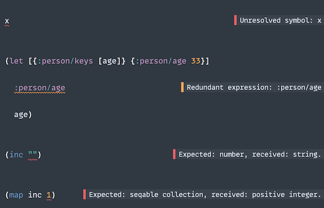
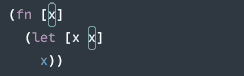

# Pep

**Pep** leverages clj-kondo analysis data to provide code navigation, documentation and usages analysis.

[clj-kondo](https://github.com/clj-kondo/clj-kondo) is the sole dependency, and everything else is supplied by built-in [Sublime Text APIs](https://www.sublimetext.com/docs/api_reference.html).

| Command | Status | Description |
| ------- | ------ | ----------- |
| `pg_pep_analyze` | Stable | Analyze view, paths or classpath |
| `pg_pep_goto_anything` | Stable | Go to anything in scope |
| `pg_pep_goto_namespace` | Stable | Go to namespace in scope |
| `pg_pep_goto_var` | Stable | Go to var in scope |
| `pg_pep_goto_keyword` | Stable | Go to keyword in scope |
| `pg_pep_goto_spec` | Stable | Go to spec in scope |
| `pg_pep_goto_definition` | Stable | Go to definition |
| `pg_pep_show_doc` | Stable | Show documentation in a popup |
| `pg_pep_jump` | Stable | Jump to occurrences of symbol or keyword |
| `pg_pep_find_usages` | Stable | Find usages in scope |
| `pg_pep_select` | Stable | Select occurrences of symbol or keyword |
| `pg_pep_highlight` | Stable | Highlight occurrences of symbol or keyword |
| `pg_pep_annotate` | Stable | Annotate view (or lint view) |
| `pg_pep_copy_name` | Stable | Copy name of keyword or symbol to the clipboard |
| `pg_pep_show_name` | Stable | Show name of keyword or symbol in a popup |


I have been working on Pep for over a year, but I still consider it alpha.
Pep is part of my Clojure(Script) development setup, combined with [Tutkain](https://github.com/eerohele/Tutkain), so I think it's developed enough to be useful.

You're welcome to try it, and I would be happy to hear if it works for you. In case it doesn't work for you, I ask you to please create an issue, and I will do my best to address it.

## Installation

Pep is available on [PackageControl](https://packagecontrol.io/packages/Pep).


## Annotate (Lint)



## Highlight

Highlight symbol or keyword under cursor and its usages.


## Documentation

Show documentation for var under cursor.


## Jump

Jump to occurrences of symbol or keyword under cursor.


## Find Usages

Find usages of symbol or keyword under cursor.


## Select

Select occurrences of symbol or keyword under cursor. 



It behaves like a 'smart multi-cursor' and you can use it to rename symbols.

## Goto Definition

Goto definition of a local binding, var, spec, re-frame handler.

## Settings

Default settings:

```jsonc
{
    "debug": false,

    "clj_kondo_path": "clj-kondo",

    "analysis_applicable_to": ["Packages/Clojure/Clojure.sublime-syntax",
                               "Packages/Clojure/ClojureScript.sublime-syntax",
                               "Packages/Tutkain/EDN (Tutkain).sublime-syntax",
                               "Packages/Tutkain/Clojure (Tutkain).sublime-syntax",
                               "Packages/Tutkain/ClojureScript (Tutkain).sublime-syntax",
                               "Packages/Tutkain/Clojure Common (Tutkain).sublime-syntax"],

    // True if you would like to see clj-kondo warnings/errors displayed along the right-hand edge of the view.
    "annotate_view_analysis": false,

    // The font-size used by view analysis annotations.
    "annotation_font_size": "0.9em",

    // True if you would like to see the number of clj-kondo errors, if any, in the status bar.
    "view_status_show_errors": false,

    // True if you would like to see the number of clj-kondo warnings, if any, in the status bar.
    "view_status_show_warnings": false,

    // True if you would like to show the namespace of the view in the status bar.
    "view_status_show_namespace": false,

    // If you would like to add a custom prefix to the namespace of the view in the status bar.
    "view_status_show_namespace_prefix": "Namespace: ",

    // If you would like to add a custom suffix to the namespace of the view in the status bar.
    "view_status_show_namespace_suffix": "",

    // True if you would like to see the number of highlighted regions in the status bar.
    "view_status_show_highlighted": false,

    // If you would like to add a custom prefix to the number of highlighted regions in the status bar.
    "view_status_show_highlighted_prefix": "Usages: ",

    // If you would like to add a custom suffix to the number of highlighted regions in the status bar.
    "view_status_show_highlighted_suffix": "",

    // It's unlikely to need to analyze scratch views,
    // but you can run the command to analyze a view if you really need it.
    "analyze_scratch_view": false,

    // True if you would like to analyse your project's sources when the plugin is loaded.
    // (Doesn't do anything if there isn't a *.sublime-project file.)
    "analyze_paths_on_plugin_loaded": true,

    // True if you would like to analyze your project's sources when the project is loaded.
    // (Doesn't do anything if there isn't a *.sublime-project file.)
    "analyze_paths_on_load_project": true,

    // True if you would like to analyse your project's classpath when the plugin is loaded.
    // (Doesn't do anything if there isn't a *.sublime-project file.)
    "analyze_classpath_on_plugin_loaded": true,

    // True if you would like to analyze your project's classpath when the project is loaded.
    // (Doesn't do anything if there isn't a *.sublime-project file.)
    "analyze_classpath_on_load_project": true,

    // True if you would like to highlight vars, local bindings and keywords usages.
    "automatically_highlight": false,

    // True if you would like to highlight the region under the cursor.
    "highlight_self": true,

    // True if you would like to highlight the region with an outline.
    "highlight_region": true,

    // True if you would like to highlight the gutter.
    "highlight_gutter": false,
}
```

## Sublime Project

To analyze your project's classpath and paths (your own files), you need to configure Pep in your Sublime Project.

If you configure `paths`, you will be able to go to definition, show documentation and find usages of vars in your project.
A paths analysis usually doesn't take long and it will run whenever you save a file - see **Settings** `"analyze_paths"`.

If you configure `classpath`, you will be able to go to definition and show documentation of vars defined in libraries.
Classpath analysis does take a little longer and it will run only when the plugin is loaded or a project is loaded - see **Settings** `"analyze_classpath"`.

Sublime Project example:

```json
{
    "pep": {
        "paths": ["src"],
        "classpath": "clojure -Spath"
    }
}
```


## Acknowledgements

- Eero and [Tutkain](https://github.com/eerohele/Tutkain); without Eero and Tutkain I would have not started this project.
- Michiel Borkent and [clj-kondo](https://github.com/clj-kondo/clj-kondo); because this project wouldn't be possible without clj-kondo.
- Peter and [Calva](https://calva.io/); Peter was too kind and allowed me to contribute to Calva on the early days and showed me how fun it is to work on these things.
- The Sublime Text Discord community; a magnificent bunch of volunteers and Sublime HQ employees tirelessly helping people with questions related to Sublime Text. (Copied from Tutkain because I could not say it better.)
